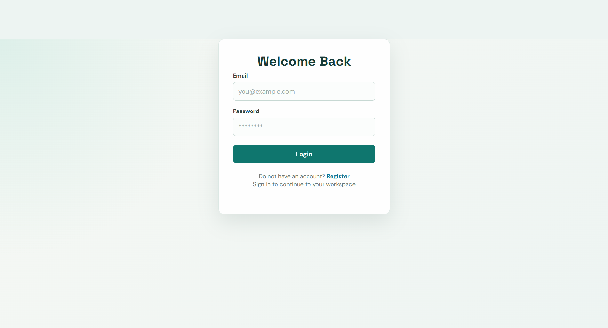
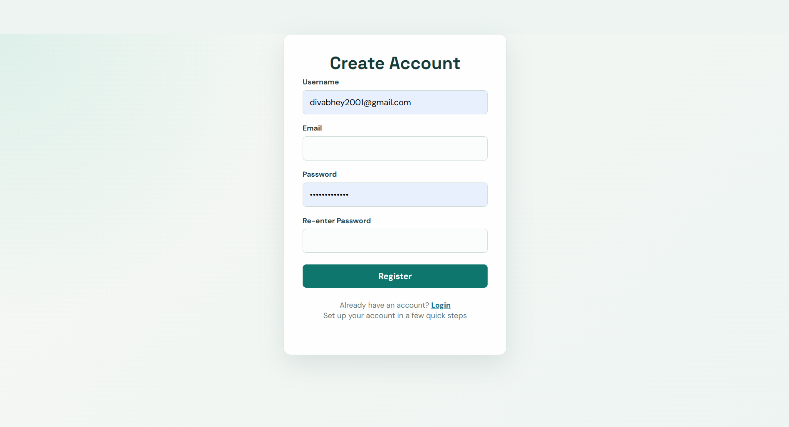
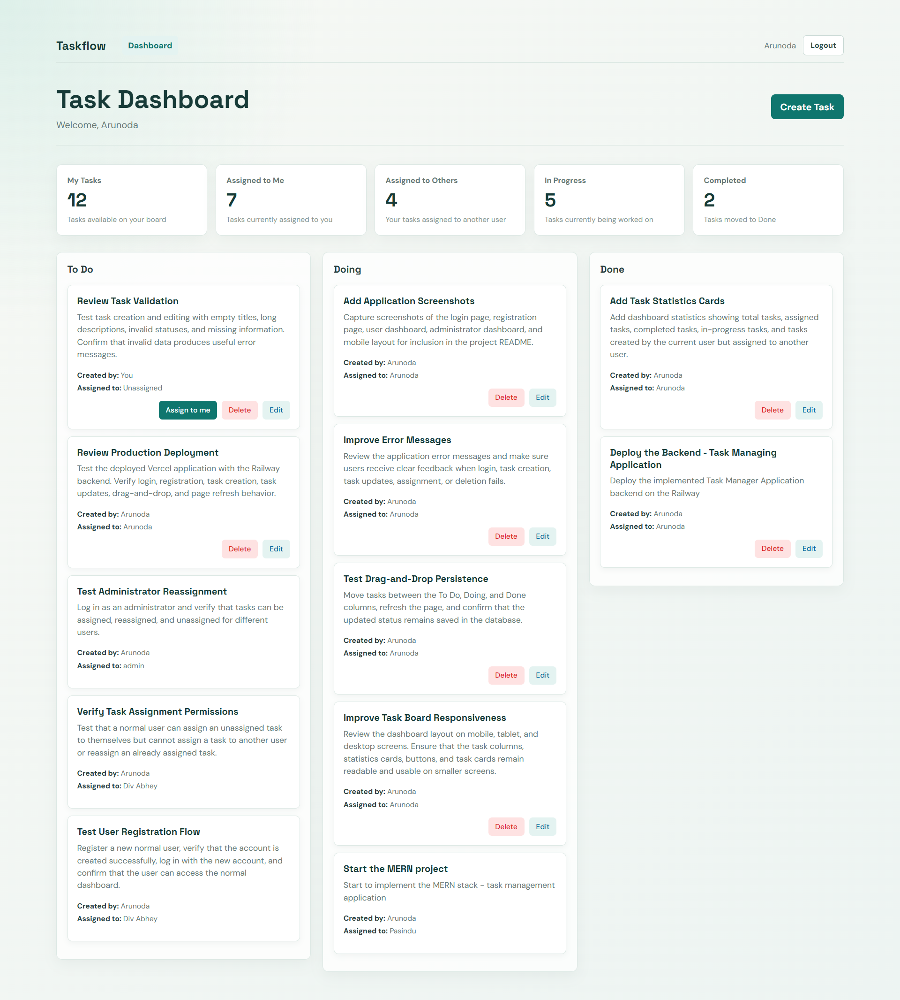
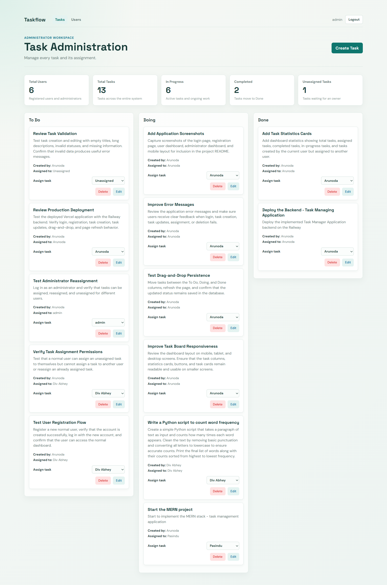

# Task Management Application

A full-stack task management application with JWT authentication, role-based permissions, a drag-and-drop task board, and separate workspaces for normal users and administrators.

## Live Application

- Frontend: `https://your-frontend.vercel.app`
- Backend API: `https://task-management-application-production-0756.up.railway.app`
- API health check: `https://task-management-application-production-0756.up.railway.app/api/health`

Replace the frontend placeholder with the final Vercel URL after deployment.

## Features

### Normal users

- Register and log in securely
- Restore an authenticated session after refreshing the page
- Create, edit, and delete tasks they control
- View tasks available to them
- Assign an unassigned task to themselves
- Move permitted tasks between `To Do`, `Doing`, and `Done`
- View dashboard statistics, including:
  - Total visible tasks
  - Tasks assigned to the current user
  - Tasks created by the user and assigned to someone else
  - In-progress tasks
  - Completed tasks

### Administrators

- Log in through the same authentication system
- View all users and tasks
- Create, edit, and delete tasks
- Reassign tasks to any user or leave them unassigned
- Move any task between status columns
- View administrator statistics, including:
  - Total users
  - Total tasks
  - In-progress tasks
  - Completed tasks
  - Unassigned tasks

## Technology Stack

### Frontend

- React
- Vite
- React Router
- Axios
- `@hello-pangea/dnd`
- CSS with responsive layouts

### Backend

- Node.js
- Express.js
- Mongoose
- MongoDB Atlas
- JSON Web Tokens
- bcryptjs
- CORS

### Deployment

- Frontend: Vercel
- Backend: Railway
- Database: MongoDB Atlas

## Project Structure

```text
.
├── backend/
│   ├── scripts/
│   │   └── seedAdmin.js
│   ├── src/
│   │   ├── controllers/
│   │   ├── middleware/
│   │   ├── models/
│   │   ├── routes/
│   │   ├── db.js
│   │   └── server.js
│   └── package.json
├── frontend/
│   ├── src/
│   │   ├── api/
│   │   ├── components/
│   │   ├── context/
│   │   ├── css/
│   │   ├── hooks/
│   │   └── pages/
│   └── package.json
├── PROJECT_ROADMAP.md
└── README.md
```

## Prerequisites

- Node.js 18 or newer
- npm
- A MongoDB Atlas database
- Git

## Local Setup

### 1. Clone the repository

```bash
git clone <your-github-repository-url>
cd task-management-application
```

### 2. Install backend dependencies

```bash
cd backend
npm install
```

Create `backend/.env`:

```env
MONGODB_URI=mongodb+srv://<username>:<password>@<cluster>/<database>?retryWrites=true&w=majority
JWT_SECRET=replace-with-a-long-random-secret
PORT=5000
```

Do not commit `.env` files or real credentials.

### 3. Seed the administrator account

From the `backend` directory:

```bash
npm run seed:admin
```

The seed script creates an administrator account if one does not already exist. Change the seeded credentials before using the application in a real environment.

### 4. Start the backend

From the `backend` directory:

```bash
npm run dev
```

The backend runs at `http://localhost:5000` by default.

### 5. Install frontend dependencies

Open another terminal:

```bash
cd frontend
npm install
```

Create `frontend/.env`:

```env
VITE_API_BASE_URL=http://localhost:5000/api
```

### 6. Start the frontend

From the `frontend` directory:

```bash
npm run dev
```

Open the local URL shown by Vite, usually `http://localhost:5173`.

## Environment Variables

### Backend

| Variable | Required | Description |
| --- | --- | --- |
| `MONGODB_URI` | Yes | MongoDB Atlas connection string |
| `JWT_SECRET` | Yes | Secret used to sign and verify JWT tokens |
| `PORT` | No | Express server port; defaults to `5000` |

### Frontend

| Variable | Required | Description |
| --- | --- | --- |
| `VITE_API_BASE_URL` | Yes | Backend API base URL, including `/api` |

For Vercel, set:

```env
VITE_API_BASE_URL=https://task-management-application-production-0756.up.railway.app/api
```

## Available Scripts

### Backend

Run these commands from `backend/`:

| Command | Description |
| --- | --- |
| `npm run dev` | Start the backend with Nodemon |
| `npm start` | Start the backend in production mode |
| `npm run seed:admin` | Create the first administrator account |

### Frontend

Run these commands from `frontend/`:

| Command | Description |
| --- | --- |
| `npm run dev` | Start the Vite development server |
| `npm run lint` | Run ESLint |
| `npm run build` | Create a production build |
| `npm run preview` | Preview the production build locally |

## API Overview

### Authentication

- `POST /api/auth/register` - Register a normal user
- `POST /api/auth/login` - Log in and receive a JWT
- `GET /api/auth/me` - Get the current authenticated user

### Tasks

- `GET /api/tasks` - Get tasks visible to the authenticated user
- `POST /api/tasks` - Create a task
- `GET /api/tasks/:id` - Get one task
- `PUT /api/tasks/:id` - Update a task
- `DELETE /api/tasks/:id` - Delete a task
- `PATCH /api/tasks/:id/assign` - Assign an unassigned task to yourself
- `PATCH /api/tasks/:id/reassign` - Admin-only task reassignment

### Users

- `GET /api/users` - Admin-only user list
- `GET /api/users/:id` - Admin-only user lookup

## Permission Rules

- Normal users cannot access administrator endpoints.
- Normal users can only see tasks returned for their account.
- Normal users cannot reassign a task to another person.
- Normal users can claim only unassigned tasks through the self-assignment endpoint.
- Administrators can view all users and tasks.
- Administrators can assign, reassign, or unassign any task.
- Task status changes are persisted in MongoDB.

## Deployment

### Backend on Railway

1. Create a Railway project connected to the GitHub repository.
2. Configure the service root directory as `backend` if required by the project settings.
3. Set these Railway variables:

```env
MONGODB_URI=<production-mongodb-atlas-connection-string>
JWT_SECRET=<production-jwt-secret>
PORT=<railway-provided-port-or-5000>
```

4. Use `npm start` as the start command if Railway does not detect it automatically.
5. Confirm the health endpoint returns:

```json
{"message":"API is running"}
```

### Frontend on Vercel

1. Import the GitHub repository into Vercel.
2. Set the project root or Vercel Root Directory to `frontend`.
3. Vercel should detect the Vite build automatically.
4. Add this environment variable:

```env
VITE_API_BASE_URL=https://task-management-application-production-0756.up.railway.app/api
```

5. Deploy the frontend.
6. After deployment, verify registration, login, task operations, drag-and-drop, and administrator reassignment.

After the Vercel URL is known, restrict backend CORS to that origin in `backend/src/server.js` and redeploy the backend.

## Screenshots

Add screenshots to `docs/screenshots/` and uncomment the matching image lines below.

Suggested files:

- `docs/screenshots/login.png`
- `docs/screenshots/register.png`
- `docs/screenshots/user-dashboard.png`
- `docs/screenshots/admin-dashboard.png`
- `docs/screenshots/user-management.png`
- `docs/screenshots/mobile-dashboard.png`

<!-- Uncomment these lines after adding the image files. -->

<!--
### Login


### Registration


### User dashboard


### Administrator dashboard


### User management


### Mobile layout

-->

## Validation

Before deployment, run:

```bash
cd frontend
npm run lint
npm run build
```

Then manually verify:

- A normal user can register and log in.
- A normal user can create and manage permitted tasks.
- Task status changes survive a page refresh.
- An administrator can view all tasks and users.
- An administrator can reassign and unassign tasks.
- The deployed frontend communicates with the deployed backend.

## License

This project is available for educational and portfolio use. Add the final license terms here if a specific license is selected.
